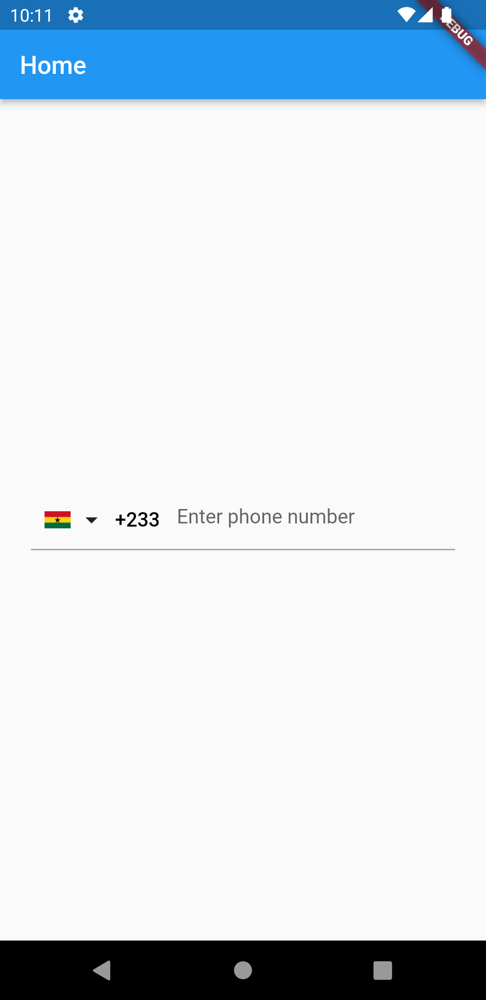
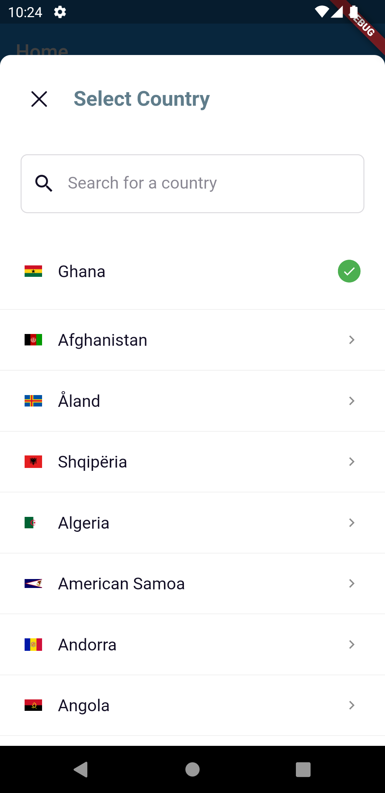

# dialcodeselector Package

Package designed to select either country or country dial code

# Screens

<div style = "align:center;">



</div>

## pubspec.yaml

```yaml
dialcodeselector: <last version>
```

## import

```dart
import 'package:dialcodeselector/dialcodeselector.dart';
```

## Simple example

```dart
//Define your default country
Country? defaultCountry = DialCodeSelector.getCountryByDialCode(dialCode: "233");

//implement callback
  void onCountrySelected(Country? country) {
    defaultCountry = country;
    setState(() {});
  }

// Define theme for the country code picker
  DialCodeSelectorTheme get selectorTheme =>
      DialCodeSelectorTheme(titleColor: Colors.blueGrey);

void showCountryPicker()async{
 await DialCodeSelector.selectCountry(BuildContext,
                            selectorTheme: selectorTheme,
                            initialShortName: defaultCountry?.countryShortName,
                            onCountrySelected: onCountrySelected);
}
```

## Features

- Selecting a country dial code
- Selecting a country
- Returns selected Country name, logo, shortname and dial code
- Get country by shortname
- Get country by dialcode
